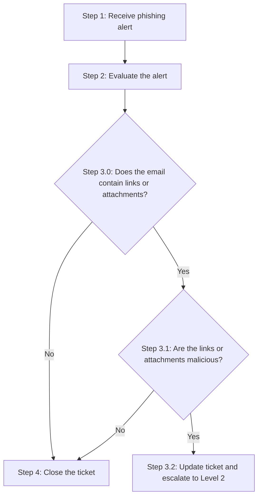

# Phishing Incident Response: Alert Triage Using a Playbook

## Project Description

This project works a phishing alert end to end as a level-one SOC analyst, following a written incident response playbook rather than improvising. I evaluated the alert ticket, walked the email for signs of impersonation and malicious content, cross-referenced a file hash against a prior VirusTotal investigation, and made a documented escalate-or-close decision with the reasoning a level-two analyst would need to pick up the case without re-doing the work.

## Scenario

A financial services company's SOC receives an alert (Ticket A-2703, severity Medium) indicating a possible phishing attempt: an employee may have opened a malicious email attachment. The email in question claims to be a job application sent to HR.

## Playbook

I followed the organization's Phishing Playbook (v1.0), which defines a fixed decision sequence for triaging phishing alerts:



Severity plays a role too: Low severity generally doesn't require escalation, Medium may require it depending on findings, and High requires immediate escalation regardless.

## Step 2: Evaluate the alert

**Alert ticket details:**

| Field | Value |
|---|---|
| Ticket ID | A-2703 |
| Alert message | SERVER-MAIL Phishing attempt possible download of malware |
| Severity | Medium |
| Details | The user may have opened a malicious email and opened attachments or clicked links |

**Email evaluated:**

```
From: Def Communications <76tguyhh6tgftrt7tg.su>
Sent: Wednesday, July 20, 2022 09:30:14 AM
To: <hr@inergy.com>
Subject: Re: Infrastructure Egnieer role

Dear HR at Ingergy,

I am writing for to express my interest in the engineer role posted from the website.

There is attached my resume and cover letter. For privacy, the file is password
protected. Use the password paradise10789 to open.

Thank you,

Clyde West

Attachment: filename="bfsvc.exe"
```

**The 5 W's:**

- **Who:** The email is signed "Clyde West" but sent from a sender display name of "Def Communications," at a `.su` domain (the former Soviet Union's ccTLD, rarely used for legitimate business email today), from IP `114.114.114.114`. That mismatch alone is a strong impersonation signal.
- **What:** A phishing email disguised as a job application, carrying a password-protected executable attachment (`bfsvc.exe`) rather than the resume and cover letter it claims to contain.
- **When:** Sent Wednesday, July 20, 2022 at 9:30:14 AM.
- **Where:** Sent to `hr@inergy.com`; the earlier investigation confirmed the attached file's hash matches a file that executed on and created unauthorized processes on an employee's machine.
- **Why:** Framing the email as a job application is a low-effort pretext that gets a busy HR inbox to open an attachment without much scrutiny, and password-protecting the executable is a deliberate evasion technique, most automated attachment scanners can't inspect the contents of a password-protected archive, so the malware only becomes visible once a human enters the password and runs it.

## Steps 3.0-3.1: Does the email contain a malicious attachment?

Yes on both counts. The email contains one attachment (`bfsvc.exe`), and that file's SHA256 hash, `54e6ea47eb04634d3e87fd7787e2136ccfbcc80ade34f246a12cf93bab527f6b`, was already confirmed malicious in a prior VirusTotal investigation: it matches Flagpro, a malware family associated with the BlackTech threat actor (see the companion [pyramid-of-pain-malware-analysis](https://github.com/mmanzanares7/pyramid-of-pain-malware-analysis) repo for that analysis). Per the playbook, a confirmed-malicious attachment routes directly to Step 3.2: escalate.

## Step 3.2: Escalation decision

**Ticket status:** Escalated

**Ticket comments:**

> The alert was triggered after an employee downloaded and opened an attachment from a phishing email disguised as a job application. Three findings support escalation: first, a sender mismatch, the display name "Def Communications" and the `.su` sending domain don't match the email's signature, "Clyde West," a classic impersonation pattern. Second, the message body contains grammatical errors ("I am writing for to express," "Egnieer" in the subject line) inconsistent with professional correspondence. Third, and most importantly, the attachment `bfsvc.exe` is password-protected, an evasion tactic to bypass automated scanning, and its SHA256 hash was independently confirmed malicious in a prior investigation, matching the Flagpro malware family associated with the BlackTech threat actor. Given the confirmed-malicious attachment and the Medium alert severity, this ticket is being escalated to a Level 2 SOC analyst for further action, including containment of the affected endpoint and a check for lateral movement.

## Summary

This investigation followed a phishing playbook's decision sequence exactly rather than jumping to a conclusion: evaluate the alert, check for a malicious link or attachment, confirm maliciousness, then escalate or close based on that finding. The sender mismatch and grammatical errors alone would have been suggestive but not conclusive; what made the escalation decision solid was combining those social engineering red flags with a hash that had already been technically confirmed malicious in a separate investigation. That combination, procedural discipline plus corroborated evidence, is what a level-two analyst needs to trust a level-one escalation without re-verifying it from scratch.
